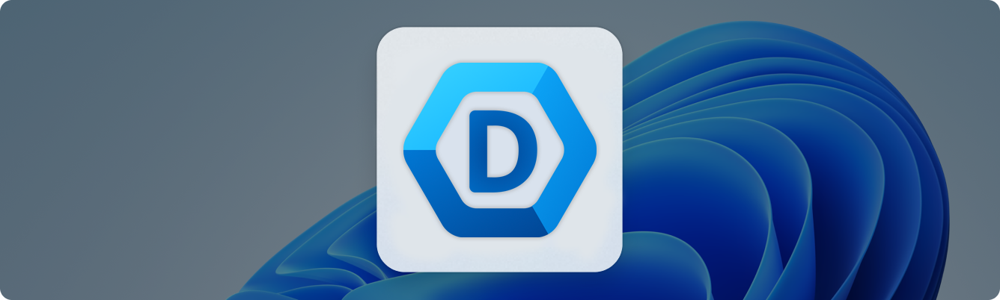

<p align="center">
  <a href="https://ghost1372.github.io/">
    
  </a>
</p>

<h1 align="center">DevWinUI</h1>

<h3 align="center">Native AOT Compatible — 99% Full support for Native AOT compilation</3>
</br>

<h3 align="center">
  <a href="https://ghost1372.github.io">Documentation</a>
  <span> · </span>
  <a href="https://ghost1372.github.io/ReleaseNotes">Release notes</a>
  <span> · </span>
  <a href="https://github.com/ghost1372/DevWinUI/tree/main/dev/DevWinUI.Gallery">Samples</a>
  <span> · </span>
  <a href="https://apps.microsoft.com/detail/DevWinUI%20Gallery%20App/9nmx5x5dlsrq?launch=true
	&mode=mini">Gallery App (Store)</a>
</h3>

<p align="center">


<a style="text-decoration:none" href="https://www.nuget.org/packages/DevWinUI">
    </a>
</p>

<center>

<div align="center">
	
|Packages|Download/Installation|Documentation|
|:---|:---|:---:|
|[](https://marketplace.visualstudio.com/items?itemName=MahdiHosseini.DevWinUITemplates)|[](https://marketplace.visualstudio.com/items?itemName=MahdiHosseini.DevWinUITemplates)|[](https://github.com/Ghost1372/DevWinUI)|
||||
|[](https://www.nuget.org/packages/DevWinUI.Base)|[](https://www.nuget.org/packages/DevWinUI.Base)|[](https://Ghost1372.github.io/DevWinUIBase)|
|[](https://www.nuget.org/packages/DevWinUI)|[](https://www.nuget.org/packages/DevWinUI)|[](https://Ghost1372.github.io/DevWinUI/)|
|[](https://www.nuget.org/packages/DevWinUI.ContextMenu)|[](https://www.nuget.org/packages/DevWinUI.ContextMenu)|[](https://Ghost1372.github.io/DevWinUIContextMenu)|
|[](https://www.nuget.org/packages/DevWinUI.Shader)|[](https://www.nuget.org/packages/DevWinUI.Shader)|[](https://Ghost1372.github.io/DevWinUIShader)|
|[](https://www.nuget.org/packages/DevWinUI.SourceGenerator)|[](https://www.nuget.org/packages/DevWinUI.SourceGenerator)|[](https://Ghost1372.github.io/DevWinUISourceGenerator)|

</div>

##

DevWinUI is a comprehensive collection of libraries, components, styles, shaders, and tools designed to help you build powerful WinUI 3 applications quickly and efficiently. Whether you’re creating modern desktop experiences for Windows 10, Windows 11, or future versions, DevWinUI brings together everything you need to accelerate development and deliver exceptional results.
- **DevWinUI is built around WinUI 3:** Microsoft’s modern native UI framework that embraces Fluent Design principles. It enables beautiful, intuitive, and accessible interfaces with the latest patterns and controls.
- **Accelerated development:** Leverage pre-built templates, scaffolding tools, and ready-to-use helper classes to streamline common tasks such as navigation, theming, and app lifecycle management. Get your project up and running in minutes while maintaining flexibility and control over your design.
- **Optimized performance:** All components are purpose-built for high performance and reliability, ensuring smooth, responsive, and scalable applications that shine across devices and environments.
- **Native AOT Compatible:** 99% full compatible with Native AOT. DevWinUI adapts to system capabilities to ensure consistent functionality and a great user experience wherever your app runs.
- **Designed for developers:** Whether you’re an experienced professional or just starting out, DevWinUI provides a unified and productive foundation to help you transform your ideas into powerful applications.
- **Build faster:** Create smarter. Deliver extraordinary experiences.

## 📚 Getting started with DevWinUI
* [Developer documentation](https://Ghost1372.github.io/DevWinUI/)
* [Gallery App](https://apps.microsoft.com/detail/DevWinUI%20Gallery%20App/9nmx5x5dlsrq?launch=true)
* [Project Templates VSIX](https://marketplace.visualstudio.com/items?itemName=MahdiHosseini.DevWinUITemplates)
* [Nightly Build](https://github.com/ghost1372/DevWinUI/actions)
* [Contribution guide](./docs/CONTRIBUTING.md)
* [Migration To v10.0.0+](./docs/Migration.md)
* [Licensing and Attribution](./docs/LICENSE.md)


Make sure to also check out the Gallery App, our interactive sample experience showing everything you can do with DevWinUI.

<a href="https://apps.microsoft.com/detail/DevWinUI%20Gallery%20App/9nmx5x5dlsrq?launch=true
	&mode=mini">
	
</a>


## 💻 DevWinUI.Base
Install this package to access core utilities, including services, helpers, extensions, managers and more.

```
Install-Package DevWinUI.Base
```

## 💻 DevWinUI
Install this package for custom controls, styles, XAML resources, and more. It also includes `DevWinUI.Base`.

```
Install-Package DevWinUI
```
After installing, add the following resource to `App.xaml`

```xml
<ResourceDictionary Source="ms-appx:///DevWinUI/Themes/Generic.xaml" />
```

Note: This library uses `Microsoft.Graphics.Win2D` internally.

## 💻 DevWinUI.ContexMenu

Add a new ContextMenu for Windows 11/10. You can use it in any .Net >= 8.0 apps which supports Package Identity. this means you can use it in WPF or WinForm with MSIX Packaging.

```
Install-Package DevWinUI.ContextMenu
```

## 💻 DevWinUI.SourceGenerator

Some useful Source Generator
```
Install-Package DevWinUI.SourceGenerator
```

## DevWinUI.Shader
DevWinUI.Shader is a high-performance rendering library for WinUI applications that enables GPU-accelerated animated backgrounds using HLSL compute shaders, powered by `ComputeSharp`, and rendered in real-time through `Win2D` `CanvasAnimatedControl`.
It is designed for developers who want modern, fluid, and fully customizable visual backgrounds without sacrificing performance or UI responsiveness.

Note: This library needs TargetFrameworks 22621+

Note: This library uses
`Microsoft.Graphics.Win2D`
`ComputeSharp.D2D1.WinUI`
internally.

```
Install-Package DevWinUI.Shader
```

##
❤️ Special thanks to **Fatemeh sadat Ashian** for designing our icon. You can find her here: [Telegram](https://t.me/Setareh1380s), [Gmail](mailto:ashyfatii@gmail.com).

## 🕰️ History

### CosmicShader


### EdgeFeathering


### StarNestShader


### StarNoiseShader


### SparkShader


### FireShader


### PureColorRenderer


### MatrixShader


### CoverShader


### FluidShader


### SeventiesMeltShader


### IceAndFireShader


### RaindropShader


### SnowShader


### FogShader


### BetterLyric


### MorphingAnimation


### AnimationPath


### LiveGraph


### PasswordGenerator


### EyeDropper


### NTPClient


### Barcode


### QRCode


### EdgeLighting


### RichButton


### Spoiler


### SidebarView


### Toolbar


### BreadcrumbBar


### ThemedIcon


### SamplePanel


### SpectrumAnalyzer


### WaveformTimeline


### LoopPanel


### CarouselView2


### CoverFlow


### ContentSlider


### CarouselView


### EasyCarouselPanel


### Stars


### BannerView


### AudioWave


### SpectrumVisualizer


### LinearGradientBlurPanel


### OrbitLoadingIndicator


### ColorAnalyzer


### StoreCarousel


### Xaml Lights


### AnimatedTextBlock


### SnapLayoutManager


### BlendedImage


### Countdown


### CircleIcon


### ImageFrame


### FrostedGlass


### ProfileControl


### FluidBanner


### ColorShadow


### Halo


### OffsetBox


### InfoCard


### GoToCard


### TabViewItem Rounded Style


### LoopingList


### LoopingSelector


### MenuFlyout SecondaryMenu Attach


### SegmentedSlider


### SystemTrayIcon


### Timeline


### SpeedGraph


### WanderingParticles


### SnowFlakeEffect


### FlipCards


### FlipBlock


### DigitalSegment


### SixteenSegmentChar


### FourteenSegmentChar


### MatrixSegmentChar


### HomePageHeader


### HeaderTile


### CheckUpdateControl


### OutOfBoxPage


### Card


### StorageBar


### StorageRing


### MessageBox


### WindowedContentDialog


### ConfettiCannon


### DepthLayerView


### GifImage


### Accordion


### ShyHeader


### AnimationExtensions


### FlipToReveal


### ArcProgress


### DropdownColorPicker


### ColorPalette


### SplitCircle


### ImageEffectBrush


### BlurEffectBrush


### BlurEffectControl


### AnimatedGradient


### ShimmerTextBlock


### ColorSlideControl


### ColorBloomControl


### ForegroundFocusEffects


### PerspectiveZoom


### CompositionShadow


### CompositionImage


### CompositionAnimationController


### HeaderCarousel


### AnimatedImage


### OverviewPageHeader


### BlurEffectManager


### Border Styles


### Grid Styles


### StackPanel Styles


### Brush


### Shortcut


### ShortcutPreview


### ShortcutWithTextLabel


### StringInfoBadge Style


### Magnifier


### NavigationView MS Store Style


### Shimmer


### SelectorBar Style


### LayeredFontIcons


### ComboBox Style


### Button Style


### DragMoveAndResize


### RelativeDate


### DelegateCommand


### ColorBrightness


### ModernSystemMenu


### ModalWindow


### LegacyMessageBox


### StepBar


### LayoutTransformer


### GoToTop


### FlexPanel


### HoneycombPanel


### ElementGroup


### Hatch


### CompareSlider


### TransitioningContentControl


### DateTimePicker


### CalendarWithClock


### Clock


### CirclePanel


### ProgressButton


### RichTextFormatter Helper


### TextBox


### BreadcrumbNavigator


### PinBox


### SelectorBarSegmented


### ColorfulShimmingEffect


### TiledImageBrush /Win2d


### OutlineTextControl /Win2d


### FlipSide


### LongShadowTextBlock


### PickCredential


### RequestWindowsPIN


### PagerControl


### IndeterminateProgressBar


### LoadingIndicator


### ThemeService / Backdrop TintColor


### OpacityMaskView


### AutoScrollView


### ProgressRing


### WaveProgressBar


### Watermark /Win2d


### BlurAnimationHelper /Win2d


### GooeyButton /Win2d


### GooeyEffect /Win2d


### GooeyFooterEffect /Win2d


### WaveCircle /Win2d


### Bubble /Win2d


### Particle /Win2d


### TextBlockStrokeView /Win2d


### TextGlitchEffect /Win2d


### TextMorphEffect /Win2d


### FontIcon Extension : Choose Fluent Icons (more than 1400) with Name or Code


### Divider


### Shield


### Gravatar


### Growl


### Transparent Backdrop


### Acrylic Backdrop


### Options Page Control


### ContextMenu


### SwitchPresenter


### Blue InfoBar


### Settings


### AutoSuggestBox Helper


### Enum Value Extension


### TextBox Extension


### Validation


### CheckBox With Description Control


### Hyperlink Button Style


### Inline AutoComplete


### TextBox Checked


### KeyVisual


### ListViewItem Setting Style


### NavigationView Service


### Shortcut


### Taskbar Helper


### LandingPages


### Settings


